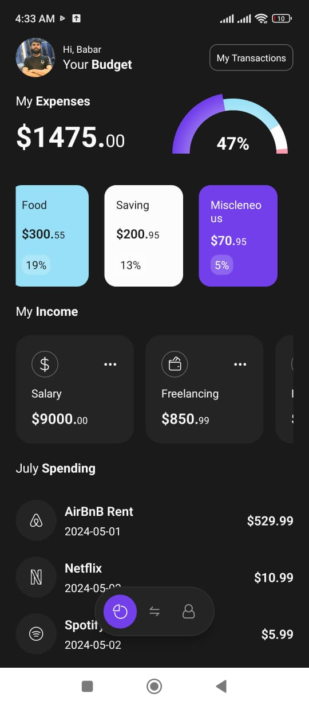

# Finance App in React Native with Expo Router 

Libraries used in this project

- Expo
- React Native Gifted Charts
- React Native SVG Tansformer


## Get started

1. Install dependencies

   ```bash
   npm install
   ```

2. Start the app

   ```bash
    npx expo start
   ```

## App Screenshot



